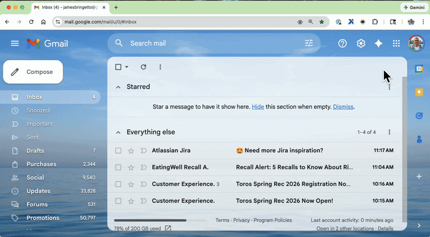
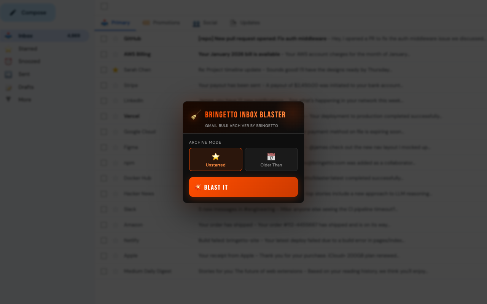
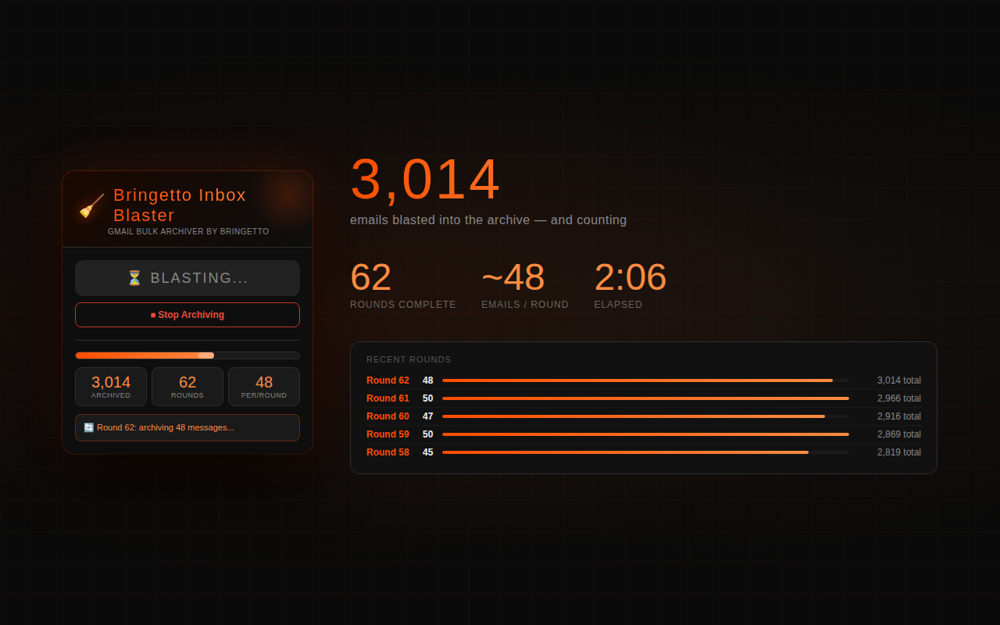
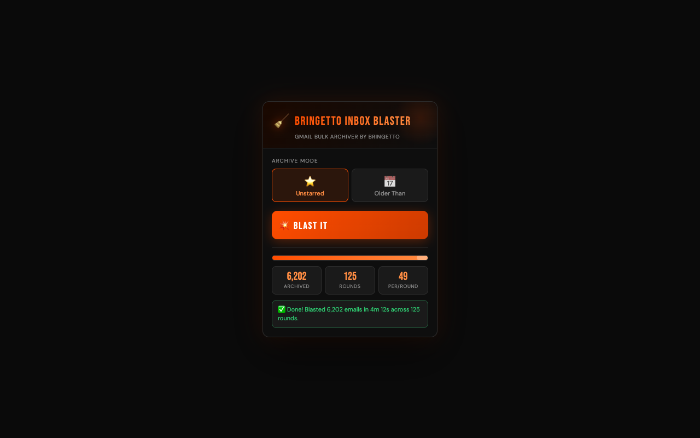
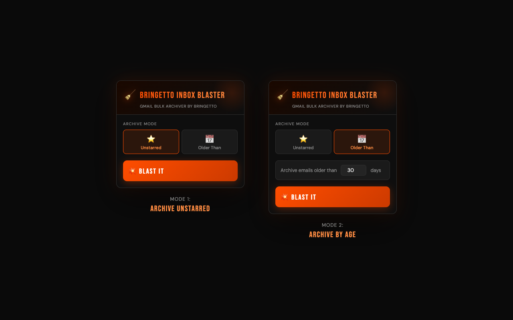
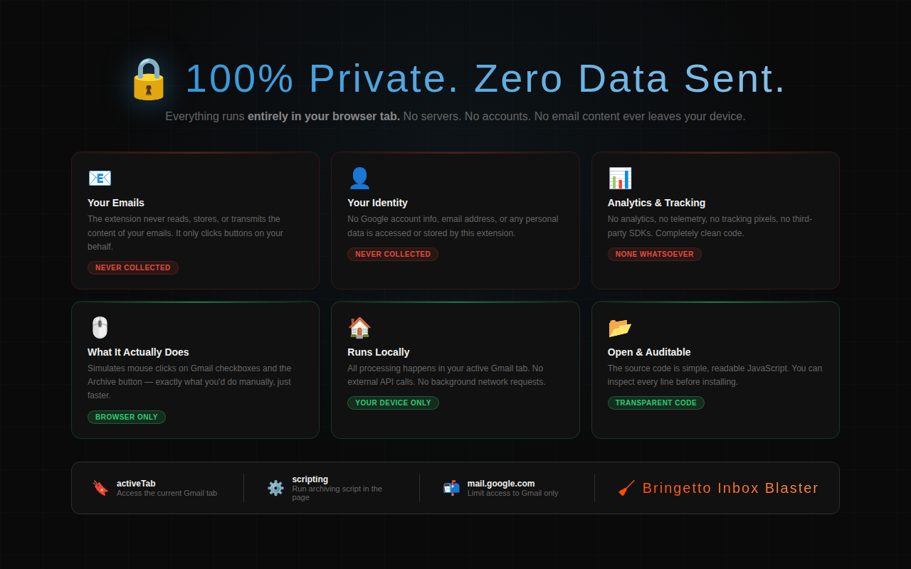

# Bringetto Inbox Blaster
Blast your Gmail inbox clean. Bulk archive unstarred messages or old emails in one click — with a real-time progress tracker.

## Download & Install

**[Download Bringetto-Inbox-Blaster.zip](Bringetto-Inbox-Blaster.zip)** — then follow the [Installation Guide](INSTALL.md) for step-by-step instructions for **Windows** and **macOS**.

> Works with Google Chrome on Windows 10/11 and macOS. No Chrome Web Store required.

## Demo

**The fastest way to reach Inbox Zero.**

Is your Gmail inbox a graveyard of newsletters, notifications, and emails you'll "get to later"? Bringetto Inbox Blaster sweeps it all away in minutes — no manual clicking, no digging through menus, no frustration.

Built by a real person who had 4,869 unread emails and got tired of it.

## How It Works

Open Gmail, click the extension icon in your Chrome toolbar, choose your archive mode, and hit **BLAST IT**. The extension automatically works through your inbox in rounds — selecting unstarred or old messages, archiving them in bulk, and moving on to the next batch. A live progress tracker shows you exactly how many messages have been blasted into the archive.

No accounts. No logins. No servers. Everything runs entirely in your browser.

## Screenshots

### Live Progress Tracking

### Inbox Zero

### Two Archive Modes

### 100% Private

## Features

- **Archive Unstarred Messages** — Any email you haven't starred is fair game. Keep the important stuff, blast the rest.
- **Archive by Age** — Set a cutoff (30 days, 90 days, a year) and archive everything older than that in one sweep.
- **Live Progress Tracker** — Watch the numbers tick up in real time: total archived, rounds completed, and average messages per round.
- **Stop Anytime** — Hit the Stop button and the extension will finish its current round gracefully before stopping.
- **100% Private** — No data ever leaves your browser. No analytics. No tracking. No accounts required.

## Perfect For

- Inbox Zero enthusiasts
- People who've let Gmail get out of hand (no judgment)
- Anyone who hoards emails "just in case"
- Power users who want bulk Gmail actions without complicated filters

## Important Notes

- Works on the standard Gmail inbox view at mail.google.com
- Starred messages are always preserved — only unstarred messages are affected
- Archived emails are **not deleted** — they move to All Mail and can be searched or restored anytime
- Gmail's interface occasionally changes its internal class names; if the extension stops working after a Gmail update, check for an updated version

## Feature Bullets

- Bulk archive all unstarred Gmail messages in one click
- Archive emails older than a custom number of days (30, 90, 365+)
- Real-time progress bar with archived count, rounds, and rate stats
- Stop button to halt the process gracefully at any time
- 100% local — no data sent to any server, no account required
- Works automatically through thousands of emails across multiple rounds
- Starred messages are always protected and never archived

## Installation

See the full [Installation Guide](INSTALL.md) for step-by-step instructions for Windows and macOS.

**Quick summary:**
1. [Download the ZIP](Bringetto-Inbox-Blaster.zip) and extract it to a permanent folder.
2. Open Chrome and go to `chrome://extensions`.
3. Enable **Developer mode** (top-right toggle).
4. Click **Load unpacked** and select the extracted folder.
5. Pin the extension to your toolbar and open Gmail.

## Privacy

See our [Privacy Policy](PRIVACY.md) for details. In short: no data ever leaves your browser.

## License

See [LICENSE](LICENSE) for details.

---

*Built with love by Bringetto. Because inbox zero shouldn't require a weekend.*
